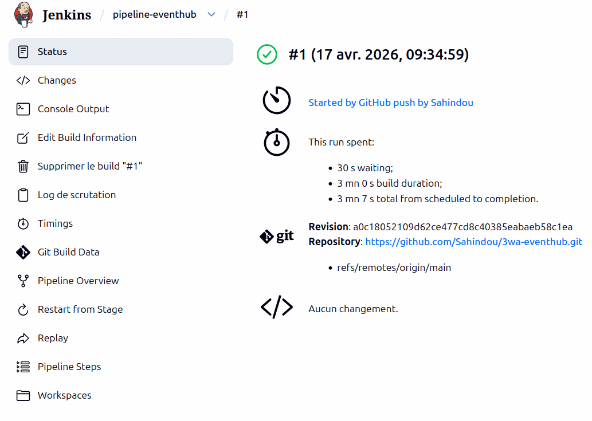
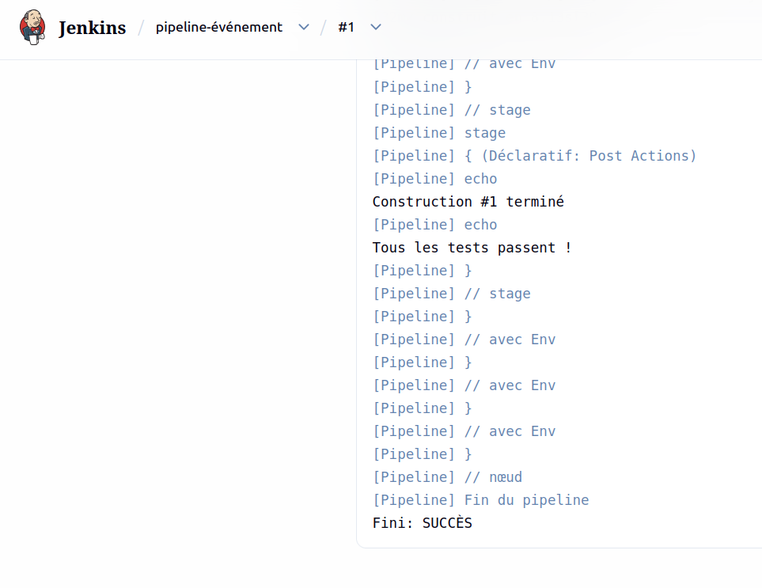
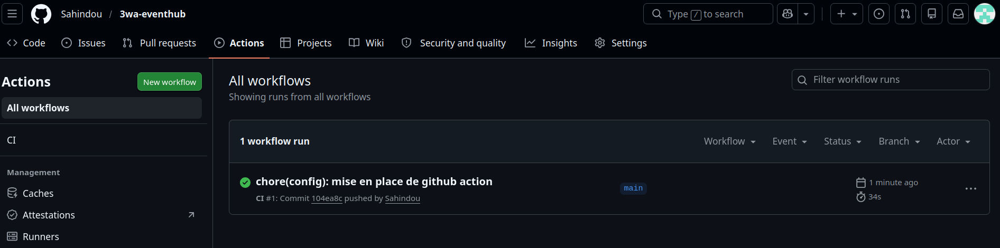
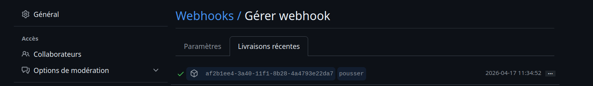

# DevOps

Le prérequis pour ce projet est **Docker**.

## Installation Jenkins

### Configuration de base

```bash
# Création du dossier et fichier de travail
mkdir ~/jenkins && cd ~/jenkins && nano docker-compose.yml
```

Puis on colle ça dedans :

```yml
services:
  jenkins:
    image: jenkins/jenkins:lts
    container_name: jenkins
    ports:
      - "8080:8080"
      - "50000:50000"
    volumes:
      - jenkins_home:/var/jenkins_home
      - /var/run/docker.sock:/var/run/docker.sock
    restart: unless-stopped
    user: root

volumes:
  jenkins_home:
```

Ensuite on lance le container :

```bash
# Lancer le container et vérifier qu'il tourne bien
docker compose up -d && docker ps | grep jenkins
```

---

## Configuration bonus — Exposition via Cloudflare Tunnel

Pour exposer Jenkins depuis internet (dans le cas d'un serveur local), on utilise **Cloudflare Tunnel** (`cloudflared`).

Cloudflare Tunnel crée une **connexion sortante chiffrée** entre le serveur et les serveurs de Cloudflare. Résultat : le service est accessible publiquement **sans ouvrir de port** sur la box/routeur.

### Création du tunnel et du DNS

```bash
# 1. Créer le tunnel (génère un identifiant unique)
cloudflared tunnel create homelab

# 2. Créer l'entrée DNS pour Jenkins
cloudflared tunnel route dns homelab jenkins.nom_domaine.io

# 3. Lancer le tunnel
cloudflared tunnel run homelab
```

> Le sous-domaine `jenkins.nom_domaine.io` est automatiquement créé dans le dashboard Cloudflare et pointe vers le tunnel. Jenkins reste accessible uniquement via HTTPS sans exposition de port.

---

## Pipeline CI/CD (Jenkins)

Le projet intègre un pipeline d'intégration continue via Jenkins, défini dans le `Jenkinsfile` à la racine du dépôt.

### Stages

| Stage | Description |
| --- | --- |
| **Checkout** | Récupération du code source depuis le dépôt Git |
| **Install pnpm** | Installation du gestionnaire de paquets pnpm |
| **Install Dependencies** | Installation de toutes les dépendances du monorepo (`pnpm install`) |
| **Prisma Generate** | Génération du client Prisma pour la compilation TypeScript |
| **Tests** | Exécution en parallèle des tests unitaires backend (40 tests) et frontend (13 tests) |
| **Build** | Compilation TypeScript du backend |

### Détails techniques

- **Monorepo** : le pipeline utilise `pnpm --filter` pour cibler chaque package (`@eventhub/backend`, `@eventhub/frontend`)
- **Tests parallèles** : les suites backend et frontend s'exécutent simultanément pour réduire le temps de build
- **Prisma** : `prisma generate` est exécuté avant les tests et le build pour que les types TypeScript soient disponibles ; `prisma migrate deploy` n'est pas nécessaire en CI car les tests sont unitaires (aucune connexion base de données requise)
- **Statut** : le bloc `post` affiche un retour explicite en cas de succès ou d'échec

### Flux du pipeline

```text
Checkout → Install pnpm → Install Dependencies → Prisma Generate → Tests (parallel) → Build
```

### Résultats Jenkins

Statut du job (vert = succès) :



Console output du pipeline :



---

## GitHub Actions (CI léger)

En complément de Jenkins, un workflow GitHub Actions est défini dans `.github/workflows/ci.yml`. Il s'exécute directement sur les serveurs de GitHub à chaque `push` ou `pull_request` sur la branche `main`.

### Workflow

```yaml
name: CI

on:
  push:
    branches: [main]
  pull_request:
    branches: [main]

jobs:
  ci:
    runs-on: ubuntu-latest
    steps:
      - uses: actions/checkout@v4
      - uses: actions/setup-node@v4
        with:
          node-version: 25
      - run: npm install -g pnpm
      - run: pnpm install
      - run: |
          pnpm --filter @eventhub/backend run test
          pnpm --filter @eventhub/frontend run test
```

### Résultat GitHub Actions

Le workflow CI s'exécute automatiquement à chaque push sur `main` et apparaît dans l'onglet Actions du dépôt :



### Configuration du Webhook

Le webhook GitHub déclenche automatiquement Jenkins à chaque push :



### Complémentarité avec Jenkins

| | Jenkins | GitHub Actions |
| --- | --- | --- |
| **Hébergement** | Serveur local (Docker) | Serveurs GitHub |
| **Rôle** | Pipeline complet (generate, build, tests) | Vérification rapide des tests sur chaque push |
| **Avantage** | Contrôle total, accès aux outils internes (Prisma) | Sans infrastructure, résultat visible directement sur GitHub |
